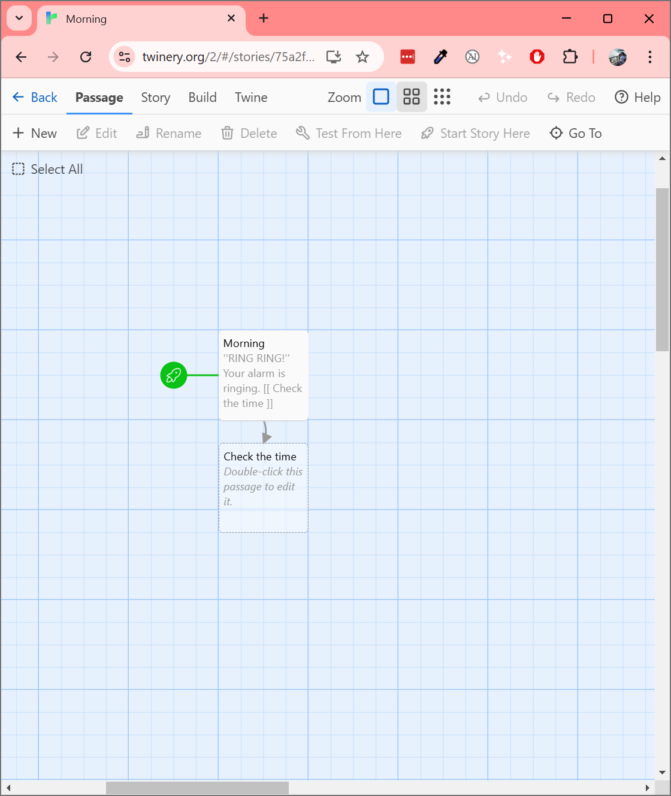
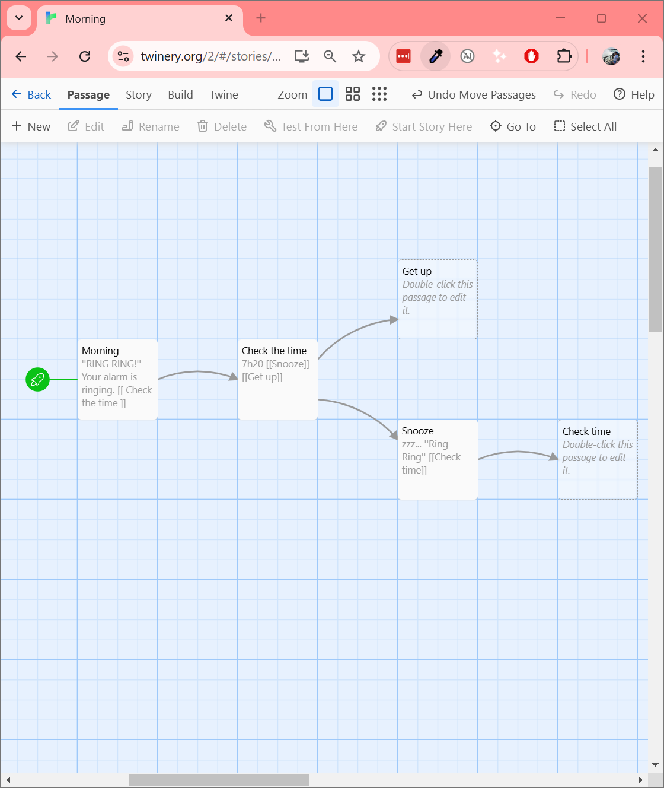
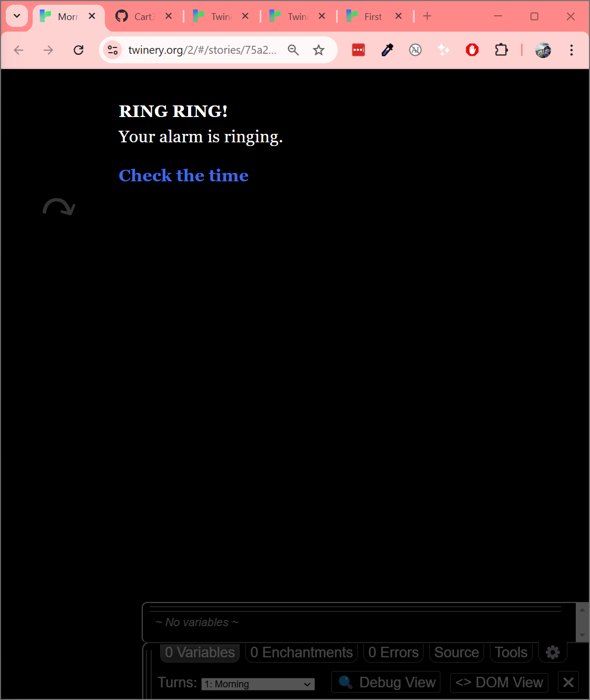
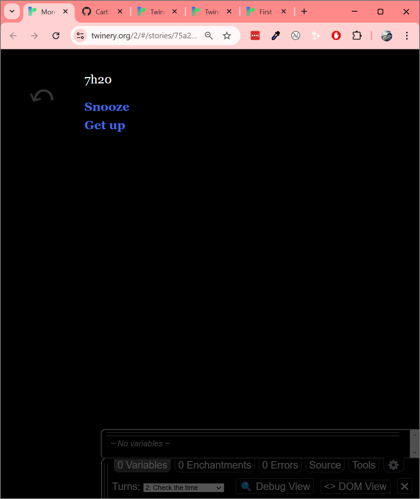
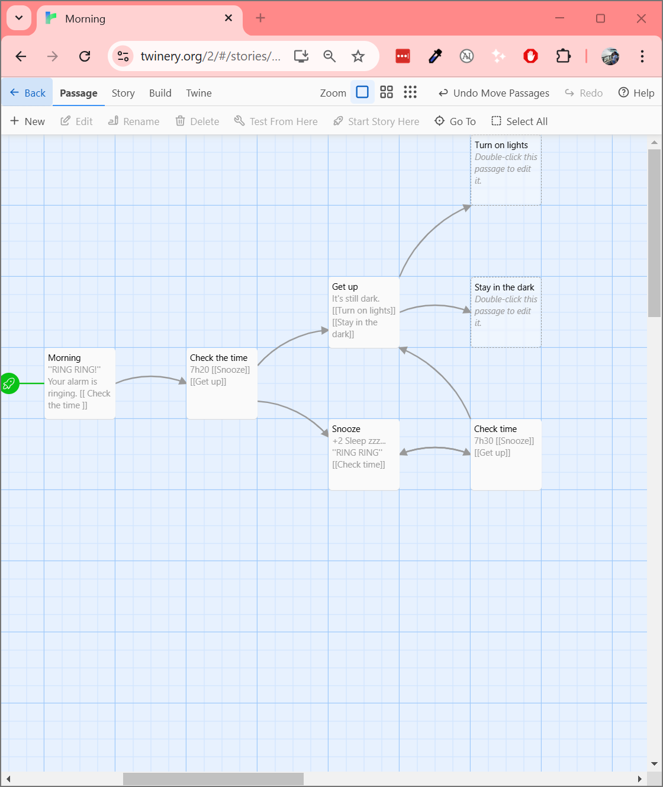
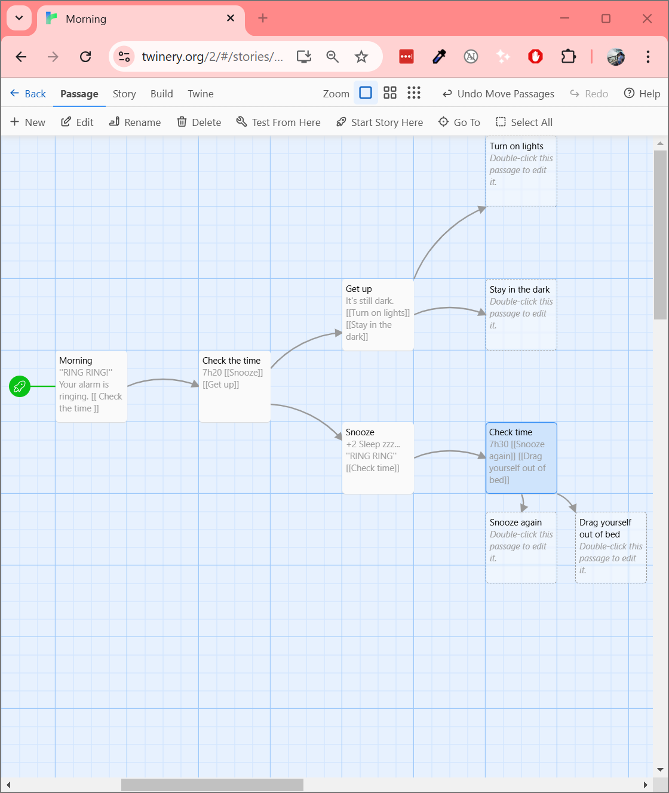
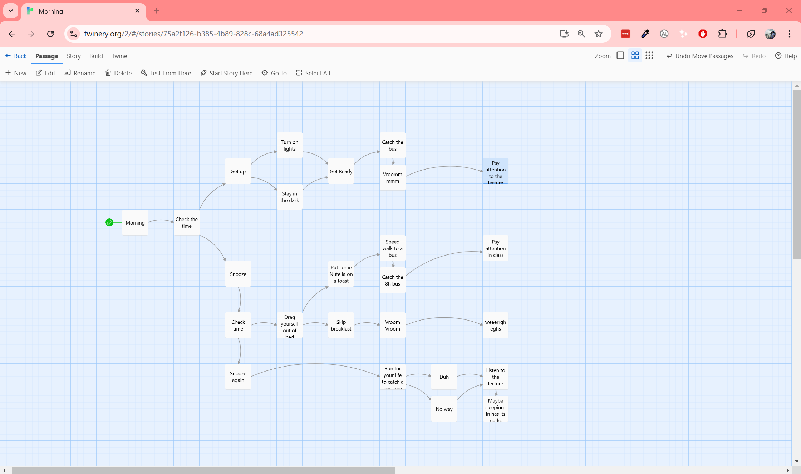
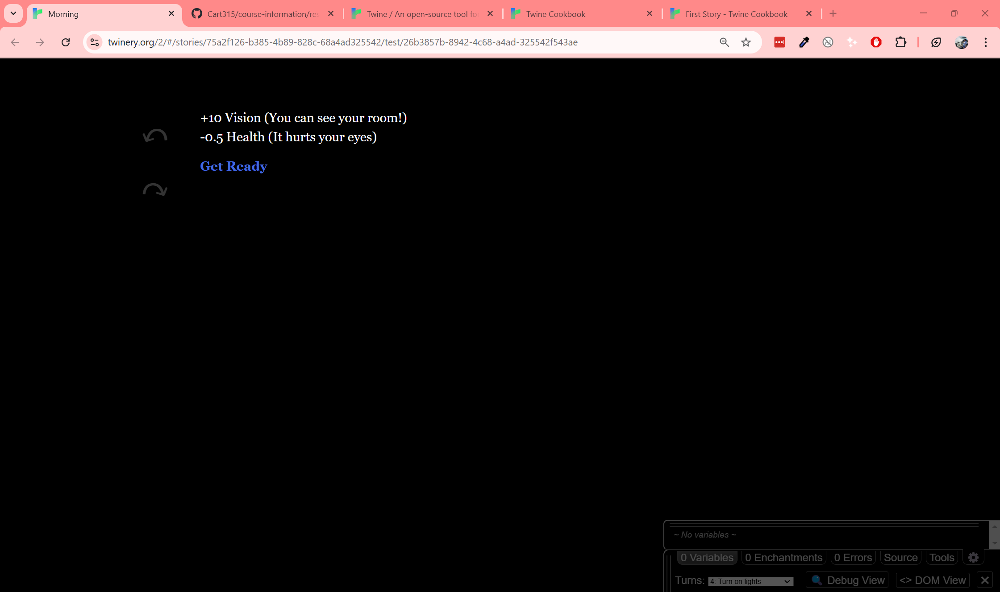
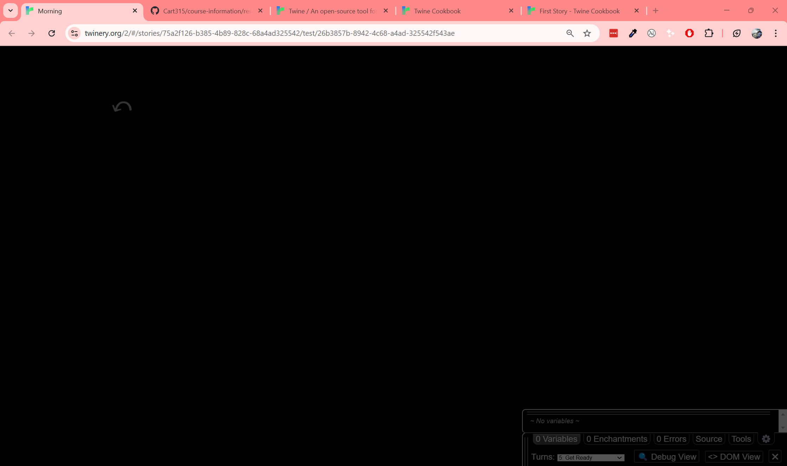
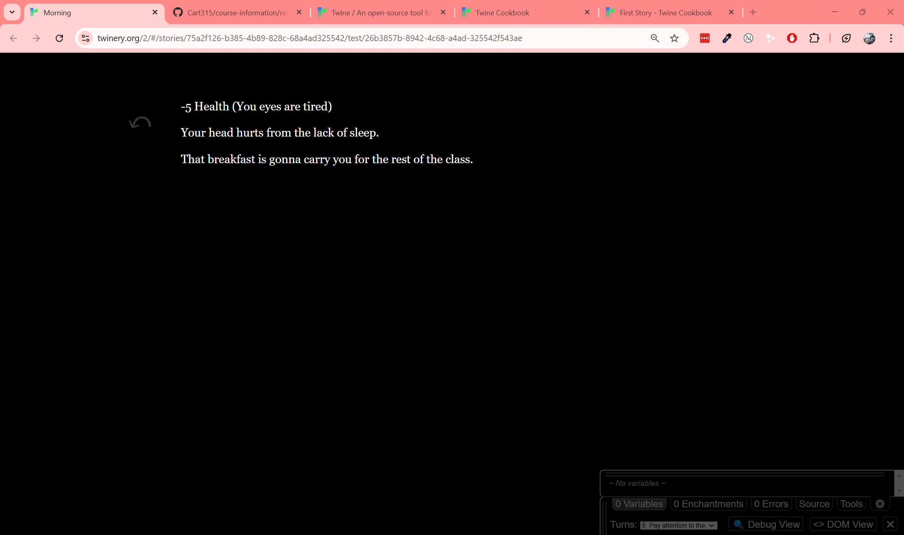

Folder for process documentation.

# Process Journal
## Index
1. [Week 1](https://github.com/Polomich/CART315/blob/main/Process/README.md#week-1-make-a-tiny-game-january-23-2025)
2. [Week 2](https://github.com/Polomich/CART315/blob/main/Process/README.md#week-2-exploration-protoype-i-january-29-2025)
3. [Week 3](https://github.com/Polomich/CART315/blob/main/Process/README.md#week-3-exploration-prototype-ii-february-6-2025)
4. [Week 4](https://github.com/Polomich/CART315/blob/main/Process/README.md#week-4-exploration-prototype-iii-february-13-2025)
5. [Week 5](https://github.com/Polomich/CART315/blob/main/Process/README.md#week-5-exploration-prototype-iiii-february-20-2025)
6. [Week 6](https://github.com/Polomich/CART315/blob/main/Process/README.md#week-6-iterative-prototype-i-march-6-2025)
7. [Week 7](https://github.com/Polomich/CART315/blob/main/Process/README.md#week-7-iterative-prototype-ii)
8. [Week 8](https://github.com/Polomich/CART315/blob/main/Process/README.md#week-8-iterative-prototype-iii)
9. [Week 9](https://github.com/Polomich/CART315/blob/main/Process/README.md#week-9-iterative-prototype-iv)
10. [Week 10](https://github.com/Polomich/CART315/blob/main/Process/README.md#week-10-iterative-prototype-v)

## Week 10: Iterative Prototype V

## Week 9: Iterative Prototype IV

## Week 8: Iterative Prototype III

### Making Levels

Messing around and testing the "pixel-art-ity" of the game  
  

How does one design a beginner level that is both easy to complete but not boring?
Some inspiration:  

Thinking of it, it might be really difficult to remember where exactly the pixels are. 
So to make it easier, the outline of the shape will be grayed in.  
Like this:  
 

Looking back at it, white tiles might be a problem with such a pale background.

### Adding features

While discussing games with a classmate last class, we started talking about Battleship.  
It got me thinking, a lot of games with a square-divided board distinguish the positions on the board by giving them coordinates.  

(https://en.wikipedia.org/wiki/Battleship_%28game%29)

(https://www.chess-universe.shop/blogs/news/lets-do-some-chess-puzzles)

Now, I am too lazy to go write all the x and y coordinates. So we're going to spend the next 10min writing code to do something that I would've taken 2min to do by hand.  

.... How do you iterate an alphabet ....

This is how: https://www.geeksforgeeks.org/javascript-program-to-print-alphabets-from-a-to-z-using-loop/

  

Well, that was way quicker and easier than I thought.

## Week 7: Iterative Prototype II

### This week will focus on digital prototyping
After a lot trial and error (and cursing out flexbox for the nth time) I managed to create this during last week's lab:

The colors just being place-holders. It took all the patience I hade to center the grid in the middle. 

For initial prototyping purposes, I decided to make the squares clickable instead of drag and dropping the pixel from the sidebar. 

After much confusion (and forgetting what I named my variables) we have clickable tiles:

### Time to make a sidebar that doesnt bring shame upon my family.
hmmm i can't work with this color palette. It was nice for testing but it's starting to bother me. 
Heading over to https://coolors.co/palettes/trending to find a palette.

Some nice palettes:  
  

  
I like pastels, and I do like these colors, but they might be too muted for the pixel pictures.

This one speaks to me:  
  

but does it fit the theme?
(the theme being animal and nature if I haven't mentioned it yet. Might have kept that thought locked in.)

Looking for some more greenery:  

Switched some colors, I like this look a lot better:  

Tried to look at some sidebar inspo. Why are all of these so boring.  

Not entirely appplicable for my context but a good example to follow:    
  
https://www.behance.net/gallery/175538095/Sidebar-menu?tracking_source=search_projects|sidebar+ux&l=7

Now why is H1 smaller than H2  
  
Nothing here makes sense  

We got a sidebar going  

### Some comparisons 
  

| Like | Dislike | Comment |
| --- | --- | --- |
| Colors are harmonious | Not enough contrast | Make bg lighter? |

| Like | Dislike | Comment |
| --- | --- | --- |
| Good contrast | I really dont like that bg color | keep this light, but diff shade |

  

| Like | Dislike | Comment |
| --- | --- | --- |
| Good contrast, good harmony |  | I went back to the bg i liked and made the text darker instead |

Now the tiles border are way too dark and also clash with the color scheme.  

Better.

## Week 6: Iterative Prototype I (March 6, 2025)

## Week 5: Exploration Prototype IIII (February 20, 2025)

### Prototyping on Paper part 2

List of endangered species: https://www.worldwildlife.org/species/directory?direction=desc&sort=extinction_status

## Week 4: Exploration Prototype III (February 13, 2025)

### Prototyping on Paper

Yet again I am burdened with a game that doesn't work (the ball doesn't move, I don't know how to make the paddle move either.)

So we are working with paper and our imagination this week. 

## Week 3: Exploration Prototype II (February 6, 2025)

### How to fix a broken game?

1. My walls are not walling. why.
   - Trying to add Rigid Body 2D, conflicting with Box Collider
   - Deleted Box Collider and replaced with Box Collider 2D
   - Added RigidBody 2D

  - OMG it did bonk! oops i left my wall too far down. game broke.  
    -> blip hasn't been assigned (i forgot it?)

2. Sound
   - going to ignore it for bc wow what an annoying sound.

4. Ball bouncing physics is not working
   - yea no, i don't know how to fix that
  
### How to add features?

1. Random color changing on bonking a wall
   - Managed to get the color to change on bonk But why is it always white?
   - wait not it *does* change color, but not in the gameplay

## Conclusion
- Nothing worked this week. I am tired. 

## Week 2: Exploration Protoype I (January 29, 2025)

### How do you use Unity?

I tried to install Unity last week with multiple fails. I did not have it installed on time for the lab demo and had to leave class early for a meeting.  
Meaning I am on my owm for this.

I'm too scared to start a project from scratch but I saw that there are templates I can use under the education tab.  
I picked the platformer. Let's see what I can play around with.

Picking a script to go mess with.  
Why can't I edit in Unity.  
Oh that's just the inspector.

Oh no VS needs to install things. Oh that was fast.

Nevermind it's gonna take forever.  
  

What is Awake, and why is not referenced anywhere?  
--> Initializer for an object.

1. First trial: changing the player color. That should be easy.
- can't find where the player color is stored.
- gonna try something else.

Insight: The player color is not set by code by image.  
Insight Correction: the player is a white colored sprite. Yet to find where the turquoise color comes from. 

2. Make the player bounce on Initialization.
- Found where the player Awakes
- The jumping methods look complicated
- I made the player Bounce!

Insight: Awake() is an initialization method in Unity. There is velocity math involved in jumping and moving around.  

3. Make the player bounce a certain amount of times using a for loop.  

As seen by my documentation, it did not work very well.

Insights: Awake() cannot contain a loop. ThreadSleep() does not work in Unity. 

Insights correction: the loop is not the problem. WaitForSecond returns something but the return type of Awake() is void so it's not compatible.  

  

This also didn't work.  
Maybe changing it to real seconds?  

This also did not work.

After inserting a bunch of print statements, I figured JumpingJacks was not being reached. Maybe I'm not calling it right?

Still not working.

So none of that worked bc it needs to be inside of a Coroutine. What the hell is a Coroutine.

YESSSSS GORGEOUS DAY  
ITS ALIVE!!!!!!!!!

4. Time to try something else. Bounce with WaitUntil() to perfect it.

This worked but the player only jumped twice. It did jump as soon as it hit the ground.  
Need to try adding more jumps and more velocity.

Player jumps high, but only 3 times. Does my iterator continue on its own while player is jumping? Is the velocity not strong enough to bounce again?

   

Every jump, the iterator goes up a few times.

This while loop did not change the outcome.

### So, what now?
- Do more research on how Unity works.
- Ask!
- Try to create something from scratch. 

## Week 1: Make a tiny game (January 23, 2025)

### How do you make a game with an engine you've never used?

I started by opening Twin.
I thought the process of creating new things would be intuitive.
I mean, there are buttons to create new passages.
Why can't I connect anything???

Time to look for instructions.
I cannot find where is the Cookbook. I am exactly where on the page that I was directed to open.
After some more snooping (and actually opening the window in fullscreen) I found the tab for starting out.

Ooo I can make thins bold! This will come in handy.
I made my first connection. I this point, I'm not entirely sure where I want my story to go.

I make the simplest thing I know.
Waking up.
Within the first few minutes of consciousness every morning, I am already making decisions.

Testing to see how it looks.
I like it.
I do not know what all the variables at the bottom of the screen are. They will be a future problem, once I figure out this engine.
Usually, I would've already started messing with the HTML and styling. But learning from my past mistakes (and being told often that I'm focusing on the wrong thig) I'm going to write before I do the visuals.

The options are also working fine.

So far the tree isn't too complicated.
But I didn’t realize that I 2 options named the same way would point to the same place.
That is troublesome. I have to find a way to differentiate them.

I don't like that I have to rename my squares, but it does push me to come up with more creative ways to name them.

I'm thinking of the options as I type them. Trying to keep everything organized.
The squares are in arranged in columns where the actions are similar. For examples of the different ways to catch a bus are in the same column but all belong to different roads. When a story option doesn't progress much (or there is only 1 option) the following square is added right below the previous.

Here I am testing out so routes. For some reason, this option leads to nowhere even though the plan clearly shows that there is a following.

I forgot to refresh the browser. Moving on. Nothing to see here.

After testing out all the routes, I realized that refreshing the page or clicking the arrows to get to the beginning is too much effort. I added a final state that will help loop back to the start.

The final game is just a short story that shows how there really isn't a happy ending. All options have their drawbacks. It is based on my Thursday mornings. They are hell. I can either get a bit more sleep but be late and hungry to class. Or waking up on time but be in pain from sleep deprivation.

### Play Testing

Game got play tested in class by 1 person.

Subject played the game over and over until they got all the routes.
Subject reported that they expected there to be a perfect ending --> BUT that does not indicate that this is a bad game. It is just what they are used to.

I told them that there isn't one. This game is based on my life. Life isn't perfect. I am in pain every Thursday.
There isn't a perfect ending because I myself don't know how to get there. Let me know if you figure it out.

### Where to find it
- the raw HTML file on GitHub: https://github.com/Polomich/CART315/blob/main/Games/Morning.html
- play the game directly on itch.io: https://polomich.itch.io/morning
